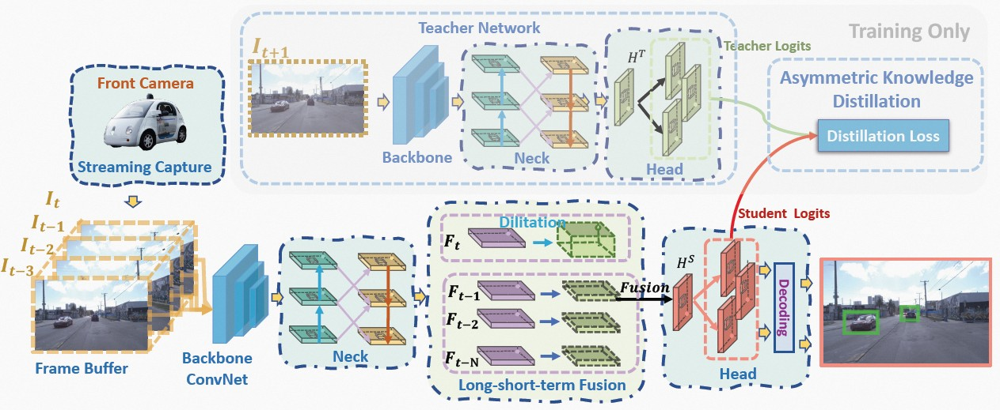

# DAMO-StreamNet: Optimizing Streaming Perception in Autonomous Driving

Real-time perception, often referred to as streaming perception, plays a pivotal role in autonomous driving. Despite its significance, there's a noticeable gap in the research dedicated to this domain. DAMO-StreamNet is our attempt to bridge this gap. This framework amalgamates the latest advancements from the YOLO series with an in-depth exploration of spatial and temporal perception mechanisms, offering a state-of-the-art solution.

<p align='center'>
  
</p>


### Key Features:
1. **Robust Neck Structure**: Incorporates deformable convolution, enhancing the receptive field and feature alignment capabilities.
2. **Dual-branch Structure**: Seamlessly integrates short-path semantic features with long-path temporal features, bolstering motion state prediction accuracy.
3. **Logits-level Distillation**: Efficiently optimizes by aligning the logits of teacher and student networks in the semantic space.
4. **Real-time Forecasting Mechanism**: Continuously updates support frame features with the current frame, ensuring uninterrupted streaming perception during inference.

The extensive results show that DAMO-StreamNet outperforms existing methods, achieving impressive sAP scores without relying on additional data. This model not only sets a new benchmark for real-time perception but also offers invaluable insights for subsequent research. Moreover, its applications extend beyond cars to other autonomous systems like drones and robots, heralding a new era of real-time perception.


## Model Zoo

|Model |size |velocity | sAP<br>0.5:0.95 | sAP50 |sAP75| coco pretrained models | weights |
| ------        |:---: | :---:       |:---:     |:---:  | :---: | :----: | :----: |
|[DAMO-StreamNet-S](./cfgs/streamnet_s.py)    |600×960  |1x      |31.8     |52.3 | 31.0 | [link](https://drive.google.com/file/d/1MdxFS7sp45oGc6CMqEnnvtG2ddQzI3s1/view?usp=sharing) | [link](https://drive.google.com/file/d/15Mi8ShE3PiVdEBMzfG2BlVkGFdWPNL19/view?usp=share_link) |
|[DAMO-StreamNet-M](./cfgs/streamnet_m.py)    |600×960  |1x      |35.5     |57.0 | 36.2 | [link](https://drive.google.com/file/d/1vJIf9CPprdDWrcisg1kCg4vxVBuSZ_kH/view?usp=share_link) | [link](https://drive.google.com/file/d/1P3STvXZPpkzJB6EmsRc0RbSM0T_D0U1Q/view?usp=share_link) |
|[DAMO-StreamNet-L](./cfgs/streamnet_l.py)    |600×960  |1x      |37.8     |59.1 | 38.6 | [link](https://drive.google.com/file/d/10rWOhrPf68zUJNigRnjaBTitI0OEEPds/view?usp=share_link) | [link](https://drive.google.com/file/d/1V__om759s2vCXy5L8A1oP8qQqPbPms5A/view?usp=share_link) |
|[DAMO-StreamNet-L](./cfgs/streamnet_l_1200x1920.py)   |1200×1920  |1x      | **43.3** | **66.1** | **44.6** | [link](https://drive.google.com/file/d/10rWOhrPf68zUJNigRnjaBTitI0OEEPds/view?usp=share_link) | [link](https://drive.google.com/file/d/17qRB7xIKkSH6RNCk0OF3XFTQO_WACA04/view?usp=share_link) |

Please find the teacher model [here](https://drive.google.com/drive/folders/1I0R68LqXt7yoUtJ-i1-uynW6dsKSO49Y?usp=sharing).

## Quick Start

### Installation

For installation, follow the guidelines provided in [StreamYOLO](https://github.com/yancie-yjr/StreamYOLO) and [LongShortNet](https://github.com/LiChenyang-Github/LongShortNet).

#### Dataset Preparation

To set up the Argoverse-HD dataset, follow the instructions [here](https://github.com/yancie-yjr/StreamYOLO#quick-start). Ensure that you place the dataset in `./data` or create symbolic links to the dataset within `./data`.

#### Models Preparation

Download the models from the links above and organize them in the `./models` directory as shown:


```
./models
├── checkpoints
│   ├── streamnet_l_1200x1920.pth
│   ├── streamnet_l.pth
│   ├── streamnet_m.pth
│   └── streamnet_s.pth
├── coco_pretrained_models
│   ├── yolox_l_drfpn.pth
│   ├── yolox_m_drfpn.pth
│   └── yolox_s_drfpn.pth
└── teacher_models
    └── l_s50_still_dfp_flip_ep8_4_gpus_bs_8
        └── best_ckpt.pth

```

### Train

To initiate training, execute:
```shell
bash run_train.sh
```

### Evaluation
For model evaluation, run:

```shell
bash run_eval.sh
```


## Acknowledgment
Our work heavily relies on the foundations laid by [StreamYOLO](https://github.com/yancie-yjr/StreamYOLO) and [LongShortNet](https://github.com/LiChenyang-Github/LongShortNet). We extend our heartfelt gratitude to the authors for their groundbreaking contributions.


## Copyright and Usage Restrictions

This software and associated documentation files (the "Software") are provided for **academic research purposes only**. Redistribution and use in any form, with or without modification, are prohibited without the express written permission of the copyright holder.

Any use of the Software should cite the appropriate academic publications. Commercial use or any activities other than academic research are strictly prohibited.

By accessing, downloading, or using the Software, you agree to comply with the above terms.


